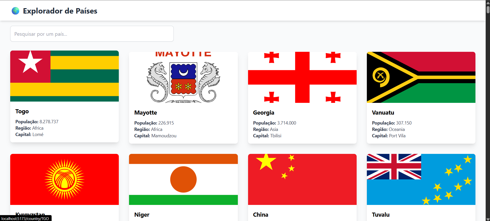

# Explorador de Países ([Click Here](https://explorador-de-paises.vercel.app/))



## SOBRE ESTE PROJETO!

Este é um projeto proposto na disciplina "Desenvolvimento Web Avançado", do curso superior de Análise e Desenvolvimento de Sistemas, no Instituto Federal de Mato Grosso do Sul (IFMS). [Explorador de Países](https://explorador-de-paises.vercel.app/) tem como objetivo é demonstrar as habilidades em desenvolvimento de interfaces modernas e dinâmicas com React.

## Objetivo

O objetivo do projeto é criar uma aplicação web interativa que consome a API pública [REST Countries](https://restcountries.com/) para permitir aos usuários explorar informações sobre os países do mundo. A [aplicação](https://explorador-de-paises.vercel.app/) deve ser funcional e relevante para o aprendizado.

As funcionalidades incluem:

- Visualização de todos os países em formato de cartões.
- Campo de busca para filtrar países por nome.
- Página de detalhes para cada país com informações completas.
- Navegação entre a página inicial e as páginas de detalhes.

## Tecnologias usadas

- [**React**](https://react.dev/)
- [**TypeScript**](https://www.typescriptlang.org/)
- [**Vite**](https://vite.dev/)
- [**Tailwind CSS**](https://tailwindcss.com/)
- [**React Router**](https://reactrouter.com/) para a navegação
- [**Axios**](https://www.npmjs.com/package/axios) para o consumo da API

## Como Executar Localmente

Como este projeto será entregue via um repositório público no GitHub, siga os passos abaixo para executá-lo em sua máquina.

1.  **Clone o repositório:**
    ```bash
    git clone https://github.com/Netinhoalves/explorador-de-paises
    ```
2.  **Navegue até a pasta do projeto:**
    ```bash
    cd <NOME_DA_PASTA_DO_PROJETO>
    ```
3.  **Instale as dependências:**
    ```bash
    npm install
    ```
4.  **Inicie o servidor de desenvolvimento:**
    ```bash
    npm run dev
    ```
5.  Abra seu navegador e acesse `http://localhost:5173` (ou a porta indicada no terminal).
